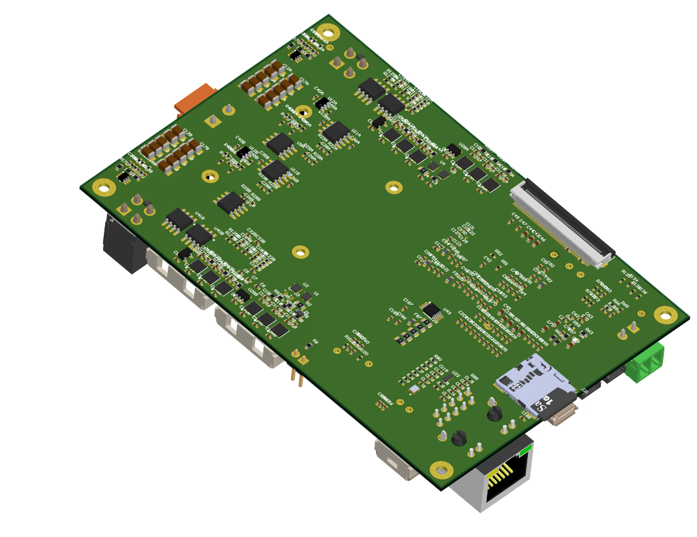

# MotionBoard

Compact 2 BLDC motor driver 10A/48V

## Specification

### Dimensions

Description | Value | Unit
---- | :--: | :--: |
Length | 120 | mm |
Width | 80 | mm |
Height | 10 | mm |

The fixation is ensured by 4x M2.5 holes.
An additional heat sink can be attached by 4x M2 scews

### Electrical specifications

Specification | Acronym | Minimum | Nom | Maximum | Unit
------------ | ---- | :-----: | :-----: | :-----: | ----
Power input | VBUS | 10 | 24 | 48 | V
Logic input | VLOG | 4.5 | 5 | 5.5 | V
Phase current | IPH | 0 | 10 | 30 | Arms

### Motors

- 3-phase brushless motor
- DC motor

### HALL

- 2x3 Digital HALL 5V sensor

### Limit Switches

- 2x3 Digital Inputs for limit switches

### Encoders

The hardware allows up to use four encoders simulatenously

- 4x Quadrature incremental encoder (A/B/I)
- 2x SinCos 1Vpp encoder (Sin/Cos/Ref)
- 4x BiSS digital absolute encoder (MA/CK)
- 4x EnDAT 2.1 encoder (MA/CK)
- 4x SSI digital encoder
- 2x HALL digital

Port | INC | SinCos | Resolver | Digital
------------ | :-----: | :-----: | :-----: | :-----: |
A1 | ✓ | | | ✓
A2 | ✓ | ✓ | ✓ |
B1 | ✓ | | | ✓
B2 | ✓ | ✓ | ✓ |

### Communication

- **I2C** The default address is 0x42
- **CAN** CAN/CanOpen CiA402 Profile compliant
- **ETHERNET** TCP/IP, HTTP Web Interface
- **USB 2.0** Device/OTG

### Storage

A Micro-SD card in SPI mode is supported. The SDCard is primarly used to store the HTTP SPA commissionning tool.

### Other

UART is 45 Mbps
SPI is 250 MHz

USB
SSI
CM-UART

Sur ma carte !

CM-I2C et non I2C !
CAN-FD et non CAN !

FIFO 16-bit x 8
datasize 16 bits max

CM Operating at 125 MHz

12x TC CMCLK ? 10 Mbps?

CM-UART : 15.625 Mbps
CM-SSI : SPI Mode
USB Virtual com port ?
Ethernet : 100 MBit / ??
CM-I2C 1Mbps

TPIU usage ? Useful in our application?

§6.5.5 High-speed SPI Pin Muxing !
§6.5.6 High-speed SSI Pin Muxing

Crystal 20MHz ESR 45, time ppm <

C145
C283 10p

0 1
31 32
104 105

- FSI ?
